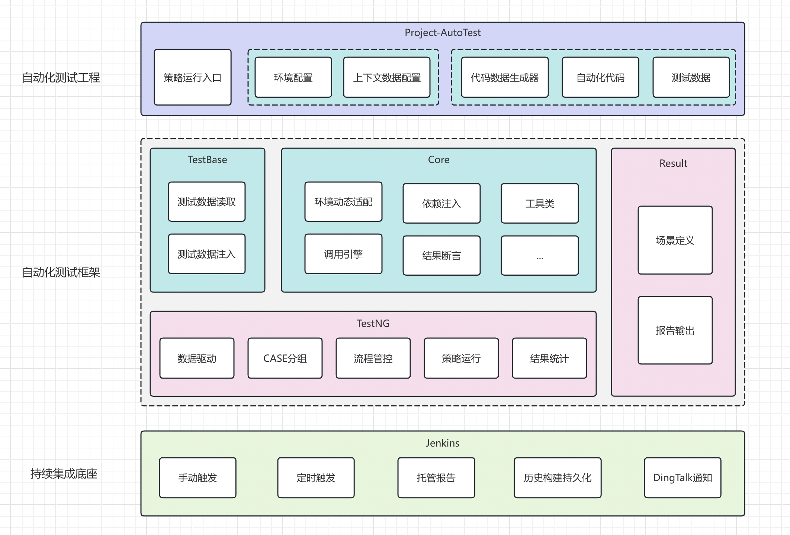

# Kratos-接口自动化测试框架

### 一.介绍
##### 接口自动化测试框架   
Kratos（奎托斯），又名克雷多斯，是动作冒险游戏《战神》系列的主角。

### 二.架构图


### 三.使用方法

1. 新建空白maven工程
2. pom.xml引入kratos框架，坐标如下：
```xml
<dependency> 
    <groupId>com.be.test.kratos</groupId> 
    <artifactId>kratos</artifactId> 
    <version>2.0.1-SNAPSHOT</version> 
</dependency> 
```
3. 添加好如上jar包之后，就可以在/src/test/java目录下新建测试类，在src/test/resources/testData新建测试数据
4. 测试工程根目录下添加两个文件
   1. context.yml 上下文依赖数据；
   2. env.properties 测试环境地址；
5. context.yml文件内容展示：
```yaml
leader:
    - token,        # 鉴权的token
    - xxName,       # 名称
    - xxx,          # xxx


partner:
    - token,        # 鉴权的token
    - xxName,       # 名称
    ...
```
6. env.properties文件内容展示：
```properties
leader.host=http://10.10.10.10
partner.host=http://11.11.11.11
partner1.host=http://22.22.22.22
partnerOther.host=http://33.33.33.33
```
7. 完整的测试工程pom文件如下：
```xml
<?xml version="1.0" encoding="UTF-8"?>
<project xmlns="http://maven.apache.org/POM/4.0.0"
         xmlns:xsi="http://www.w3.org/2001/XMLSchema-instance"
         xsi:schemaLocation="http://maven.apache.org/POM/4.0.0 http://maven.apache.org/xsd/maven-4.0.0.xsd">
    <modelVersion>4.0.0</modelVersion>

    <groupId>com.test</groupId>
    <artifactId>Project-AutoTest</artifactId>
    <version>1.0-SNAPSHOT</version>

    <properties>
        <project.build.sourceEncoding>UTF-8</project.build.sourceEncoding>
        <aspectj.version>1.9.9.1</aspectj.version>
        <maven.compiler.source>9</maven.compiler.source>
        <maven.compiler.target>9</maven.compiler.target>
    </properties>

    <dependencies>
        <dependency>
            <groupId>com.xx.test.kratos</groupId>
            <artifactId>kratos</artifactId>
            <version>2.0.1-SNAPSHOT</version>
        </dependency>
    </dependencies>

    <build>
        <pluginManagement>
            <plugins>
                <plugin>
                    <groupId>org.apache.maven.plugins</groupId>
                    <artifactId>maven-compiler-plugin</artifactId>
                </plugin>
                <plugin>
                    <groupId>org.apache.maven.plugins</groupId>
                    <artifactId>maven-surefire-plugin</artifactId>
                    <!--                    <version>2.22.2</version>-->
                    <version>3.1.2</version>
                    <configuration>
                        <!--测试失败后，是否忽略并继续测试-->
                        <testFailureIgnore>true</testFailureIgnore>
                        <suiteXmlFiles>
                            <suiteXmlFile>src/test/resources/testng.xml</suiteXmlFile>
                        </suiteXmlFiles>
                        <argLine>
                            -javaagent:"${settings.localRepository}/org/aspectj/aspectjweaver/${aspectj.version}/aspectjweaver-${aspectj.version}.jar"
                        </argLine>
                        <systemProperties>
                            <property>
                                <!--配置 allure 结果存储路径-->
                                <name>allure.results.directory</name>
                                <value>${project.build.directory}/allure-results</value>
                            </property>
                        </systemProperties>

                    </configuration>
                    <dependencies>
                        <dependency>
                            <groupId>org.aspectj</groupId>
                            <artifactId>aspectjweaver</artifactId>
                            <version>${aspectj.version}</version>
                        </dependency>
                    </dependencies>
                </plugin>
                <plugin>
                    <groupId>io.qameta.allure</groupId>
                    <artifactId>allure-maven</artifactId>
                    <version>2.11.2</version>
                </plugin>
                <plugin>
                    <groupId>org.apache.maven.plugins</groupId>
                    <artifactId>maven-resources-plugin</artifactId>
                </plugin>
            </plugins>
        </pluginManagement>

        <resources>
            <resource>
                <directory>src/test/resources/*</directory>
            </resource>
        </resources>
    </build>

</project>
```
8. 测试工程的测试类和测试数据文件生成工具用法：
   1. 新建一个类，名字随便取，我这里叫genTestCase；
   2. 写个通过main方法去调用对应的生成方法；
   3. 生产方法传入对应的类名和方法名即可；
   4. 测试类和测试数据会一起生成，去对应目录查看即可。
9. 完整demo代码如下：
```java
package com.xx;

import com.xx.kratos.utils.GenTestCaseUtils;
import java.io.IOException;

public class genTestCase {
    public static void main(String[] args) throws IOException {
        GenTestCaseUtils.genTestCase("leader.leaderXXX.XXTest", "postXXXTest");
    }
}
```
